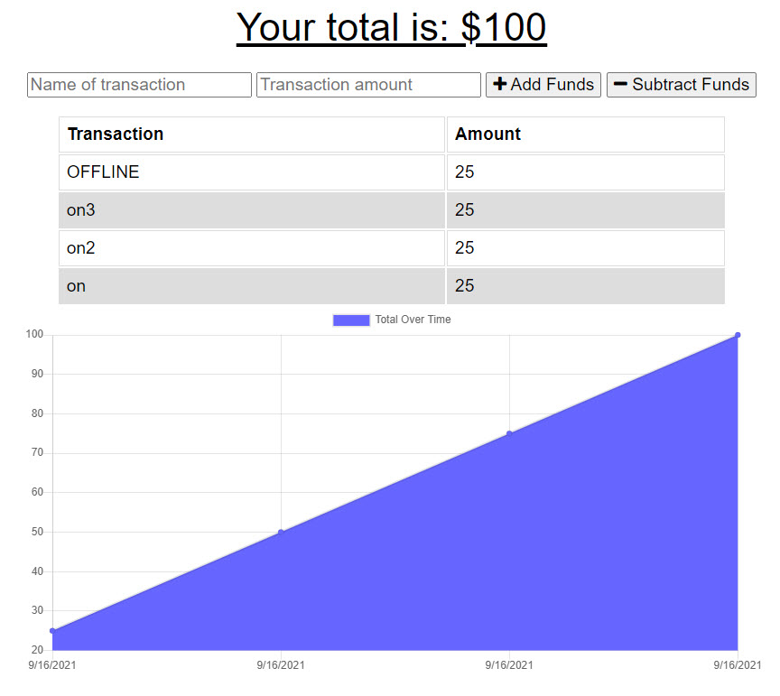

#Online/Offline Budget Trackers

This app allows a user to manage their budget online and track their entries through a cloud MongoDB while with connectivity.  When an entry is submitted while there is not any connectivity, entries are stored offline in the browsers IndexedDB for safe keeping.  Now, as soon as the user submits a record while they have connectivity again, all offline records will be uploaded and removed from the IndexedDB.

## Visit the app live at:
https://leebudgetapp.herokuapp.com/

## Steps to test:
1.  Navigate to the application while connected to the internet.
2.  Submit an entry.
3.  Note the status of the chart and entries reflected under the transactions header.
4.  Disconnect from the internet on your device/machine.
5.  Submit another transaction.
6.  If you want to validate that you've an entry saved offline, do the following:
    a.  Go to your browser console (On windows, press F12).
    b.  Select Application.
    c.  Under the Storage section, you will see IndexedDB.  Click the down arrow to its' left
    d.  You will see "budgetOffline - https://leebudgetapp.herokuapp.com/" revealed. Click the down arrow to its' left.
    e.  You will see "transactions" revealed.  Click "transactions" and you will see the your record stored there.
7.  Next, reconnect to your internet service.
8.  At this point you will only see the transactions you entered while online and the offline record will not be        
    reflected in the chart or transaction entries.
9.  Now, add another online transaction and you will then see reflected all online and offline transactions illustrated on
    the chart.
10. The IndexedDB will now be empty.  You can validate this using the steps from step #6.

## Technologies used:
1.  vanilla javascript
2.  Cloud MongoDB service
3.  Mongoose
4.  Express
5.  Heroku

### And it does keep the following as dependencies for the server and application:
  "dependencies": {
    "compression": "^1.7.4",
    "express": "^4.17.1",
    "lite-server": "^2.5.3",
    "mongoose": "^5.5.15",
    "morgan": "^1.9.1",
    "nodemon": "^2.0.12"
  }

## Credits
Created by Lee Macklin